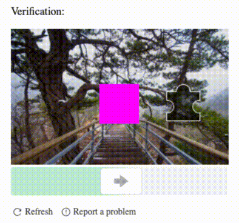

# tiktok-captcha-solver [](https://github.com/arc298/tiktok-captcha-solver/actions) [](https://www.npmjs.com/package/tiktok-captcha-solver)

> Solves the TikTok captcha interactively using playwright or puppeteer.



## Install

```bash
npm i tiktok-captcha-solver
```

## Usage

To use the captcha solver, first initialize a new instance, passing it your playwright or puppeteer page instance.
Next, call solve on the captcha solver instance. The solver will proceed to solve the captcha.

```js
const { chromium } = require('playwright')
const CaptchaSolver = require('tiktok-captcha-solver')

;(async () => {
  const browser = await chromium.launch({ headless: false })
  const page = await browser.newPage()

  // the captcha solver should be initialized before visiting the page
  const captchaSolver = new CaptchaSolver(page)

  await page.goto('https://www.tiktok.com/@tiktok')

  // solve the captcha
  await captchaSolver.solve()
})()
```

## API

### class: CaptchaSolver(page)

- `page` **[Page](https://playwright.dev/docs/api/class-page)** (Playwright) | **[Page](https://pptr.dev/#?product=Puppeteer&show=api-class-page)** (Puppeteer)

Captcha solver initialized with a page instance from Playwright or Puppeteer.

#### .solve([options])

- `options` **[Object](https://developer.mozilla.org/docs/Web/JavaScript/Reference/Global_Objects/Object)** (optional)
  - `numAttempts` **[Number](https://developer.mozilla.org/docs/Web/JavaScript/Reference/Global_Objects/Number)** max number of attempts to solve the captcha (default: `3`)
  - `startPosition` **[Number](https://developer.mozilla.org/docs/Web/JavaScript/Reference/Global_Objects/Number)** start position of the slider handle (default: `25`)
  - `positionIncrement` **[Number](https://developer.mozilla.org/docs/Web/JavaScript/Reference/Global_Objects/Number)** number of pixels to advance the slider on each iteration (default: `5`)

Solves the captcha and returns a promise.
If successful, a resolved promise is returned.
Otherwise, a rejected promise is returned if the captcha is not solved
within the specified number of attempts.

Example:

```js
const catchaSolver = new CaptchaSolver(page)

captchaSolver.solve({
  numAttempts: 3, // max number of attempts to solve the captcha
  startPosition: 25, // start position of the slider handle
  positionIncrement: 5, // number of pixels to advance the slider on each iteration
})
```

### When should I call `solve`?

- The captcha will be solved automatically whenever it becomes visible. It's your responsibility to perform any required actions to trigger the captcha being shown, if needed.
- The solver will attempt to wait until the captcha is fully loaded before attempting to solve it. This means you can call `solve` immediately after navigating to a page.
- Calling `solve` on a page that has no captcha will have no effect and the rest of your code will execute normally.

## Changelog

<details>
 <summary><strong>Changelog</strong></summary>

##### Latest

##### `0.0.3`

- Initial version

</details>

## Contributing

Pull requests are welcome. For major changes, please open an issue first to discuss what you would like to change.

- Fork it (https://github.com/arc298/tiktok-captcha-solver/fork)
- Create your feature branch (git checkout -b my-new-feature)
- Please make sure to update tests as appropriate.
- Commit your changes (git commit -am 'Add new feature')
- Push the branch (git push origin my-new-feature)
- Create a new Pull Request

## License

MIT License

Copyright (c) 2021

Permission is hereby granted, free of charge, to any person obtaining a copy
of this software and associated documentation files (the "Software"), to deal
in the Software without restriction, including without limitation the rights
to use, copy, modify, merge, publish, distribute, sublicense, and/or sell
copies of the Software, and to permit persons to whom the Software is
furnished to do so, subject to the following conditions:

The above copyright notice and this permission notice shall be included in all
copies or substantial portions of the Software.

THE SOFTWARE IS PROVIDED "AS IS", WITHOUT WARRANTY OF ANY KIND, EXPRESS OR
IMPLIED, INCLUDING BUT NOT LIMITED TO THE WARRANTIES OF MERCHANTABILITY,
FITNESS FOR A PARTICULAR PURPOSE AND NONINFRINGEMENT. IN NO EVENT SHALL THE
AUTHORS OR COPYRIGHT HOLDERS BE LIABLE FOR ANY CLAIM, DAMAGES OR OTHER
LIABILITY, WHETHER IN AN ACTION OF CONTRACT, TORT OR OTHERWISE, ARISING FROM,
OUT OF OR IN CONNECTION WITH THE SOFTWARE OR THE USE OR OTHER DEALINGS IN THE
SOFTWARE.
